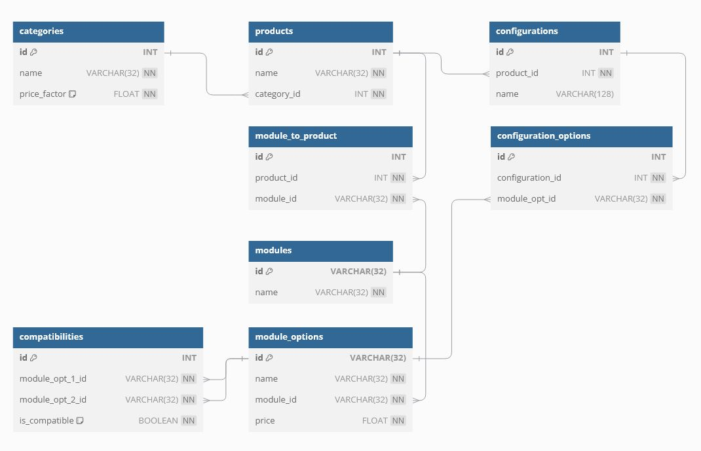

# Design Document

By Juuso Hinkkanen

## Scope
Purpose is to manage modular configuration of products to allow users customize the final product
based on the available modules. The database supports also limited pricing and compatibility checks.

In the scope are products, modules/module groups and module items/options, compatibility and pricing.
Out of scope are user management, order processing, manufacturing etc.

## Functional Requirements
The user can configure products by selecting a base product and choosing compatible modules for it.
After that the user can see the pricing and compatibility of parts.

Outside of the scope are more detailed bill of materials, analytics and processing of data.

## Representation

### Entities

In this section you should answer the following questions:

* Which entities will you choose to represent in your database?
* What attributes will those entities have?
* Why did you choose the types you did?
* Why did you choose the constraints you did?

Categories: Represents the different categories of products, which may have a specific price factor affecting the overall product price.
Attributes:
* id (INT, Primary Key)
* name (VARCHAR, Not Null)
* price_factor (FLOAT, Not Null, Default 1.0)

Products: Represents the customizable products that users can configure.
Attributes:
* id (INT, Primary Key)
* name (VARCHAR, Not Null)
* category_id (INT, Foreign Key to Categories)

Modules: Represents the groups of modular components that can be added to a product.
Attributes:
* id (VARCHAR, Primary Key, Unique)
* name (VARCHAR, Not Null)

Module Options: Represents specific variations or configurations of each module group, including their prices.
Attributes:
* id (VARCHAR, Primary Key)
* name (VARCHAR, Not Null)
* module_id (VARCHAR, Foreign Key to Modules)
* price (FLOAT, Not Null)
Rationale: Module options provide specific choices within each module group, allowing for granular customization..

Module to Product: Represents the relationship between products and the modules that can be added to them.
Attributes:
* id (INT, Primary Key)
* product_id (INT, Foreign Key to Products)
* module_id (VARCHAR, Foreign Key to Modules)
Rationale: This junction table captures the many-to-many relationship between products and modules, allowing a product to have multiple modules and a module to be used in multiple products.

Compatibilities: Represents the compatibility rules between different module options.
Attributes:
* id (INT, Primary Key)
* module_opt_1_id (VARCHAR, Foreign Key to Module Options)
* module_opt_2_id (VARCHAR, Foreign Key to Module Options)
* is_compatible (BOOLEAN, Not Null, Default 0)
Rationale: Compatibility rules are crucial for ensuring valid product configurations.

### Relationships

## Optimizations

I included indexes to tables where I assume to be many rows repeating the same id's such as compatibilities, module_to_product and module_options with a great amount of many-to-many relations.

## Limitations

Naturally this a very limited version of a product configurator.
* I would like to still improve the structure of compatibility checks and configurations, as there has to be a more efficient way to achieve that.
* I would like to add more functions or a system regarding rules of the configuration.
* Also the configuration can't be done on material level as it needs modules to be built with bill of materials. Is it an advantage or disadvantage, depends a lot on the environment where this would be used.

